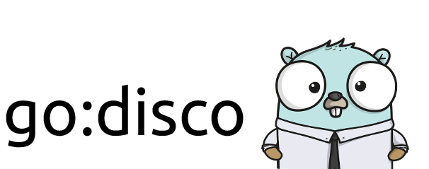

[](LICENSE.md)




# go:disco - Machine Learning using Go

`go:disco` is a Docker container for doing machine learning research and development using Go.

## Quick Start

To start an interactive **go:disco** Docker container:

```sh
docker run --rm -it \
    --name disco \
    erikhoward/go-disco \
    /bin/bash    
```

To run a Jupyter notebook with a Go kernal:
```sh
docker run --rm -it \
    --name disco \
    -p 8888:8888 \
    erikhoward/go-disco \
    jupyter notebook --ip=0.0.0.0 \
    --notebook-dir=/home/disco/notebooks
```
## Features
* TensorFlow
* Jupyter notebook with Go kernal - [yunabe/lgo]
* Go Dataframes - [gota/dataframe]
* Matrix, Statistics, Probability, Distributions, Sampling and Network Analysis - [gonum]
* Multivariable Linear Regression - [sajari/regression]
* Ridge Regression - [berkmancenter/ridge]
* Logistic Regression - [xlvector/hector, cdipaolo/goml]
* Softmax Regression - [cdipaolo/goml]
* Ordinary Least Squares - [cdipaolo/goml]
* Locally Weighted Linear Regression - [cdipaolo/goml]
* Bayesian Logistic Regression - [xlvector/hector]
* Random Forest, Random Decision Trees, CART, Gradient Boosting Decision Tree - [xlvector/hector, sjwhitworth/golearn, ryanbressler/CloudForest]
* AdaBoost - [ryanbressler/CloudForest]
* KNN - [xlvector/hector, cdipaolo/goml, sjwhitworth/golearn, akreal/knn]
* K-Means - [cdipaolo/goml, mash/gokmeans]
* Perceptron - [cdipaolo/goml]
* NLP, LSA, LDA - [james-bowman/nlp]
* PCA - [james-bowman/nlp]
* TF-IDF - [cdipaolo/goml, james-bowman/nlp]
* Sentence Tokenizer - [neurosnap/sentences]
* Multiclass Naive Bayes - [cdipaolo/goml]
* Approximate Nearest Neighbor - [rikonor/go-ann]
* Deep Neural Network - [Fontinalis/fonet]
* Perceptual Image Hashing - [corona10/goimagehash]
* Web Crawling and Scraping - [antchfx/antch]
* Compression and Decompression - [mholt/archiver]
* Error Handling - [pkg/errors]
* Dependency Management - [golang/dep]
* Datastore Support
  * MongoDB - [mongodb/mongo-go-driver]
  * MySQL, MariaDB, Google Cloud SQL - [go-sql-driver/mysql]
  * Postgres - [jackc/pgx]
  * sqlite3 - [mattn/go-sqlite3]


## Contributing

Please see our guide on [contributing to go:disco](CONTRIBUTING.md)

## Bugs and Feature Requests

Found a bug? Have a feature request? Found something missing in the documentation? Let me know by [creating a new issue](https://github.com/erikhoward/go-disco/issues/new).

## TODO

- [ ] Add support for opencv
- [ ] Add CUDA support

## Acknowledgements

* [lgo - Go (golang) Jupyter Notebook kernal and interactive REPL](https://github.com/yunabe/lgo)

## License

go:disco is under the MIT license. See the [LICENSE](LICENSE.md) file for details.

## Author
Erik Howard - [https://www.erikhoward.net](https://www.erikhoward.net)
, [@erik_howard](http://twitter.com/erik_howard)